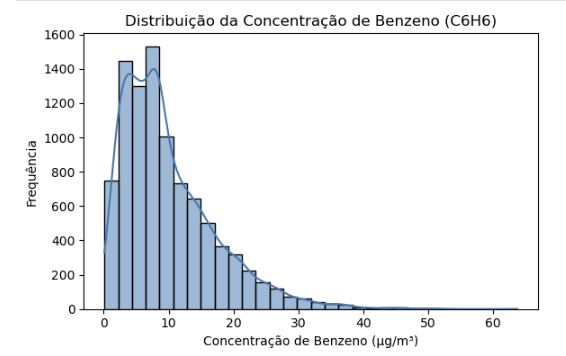
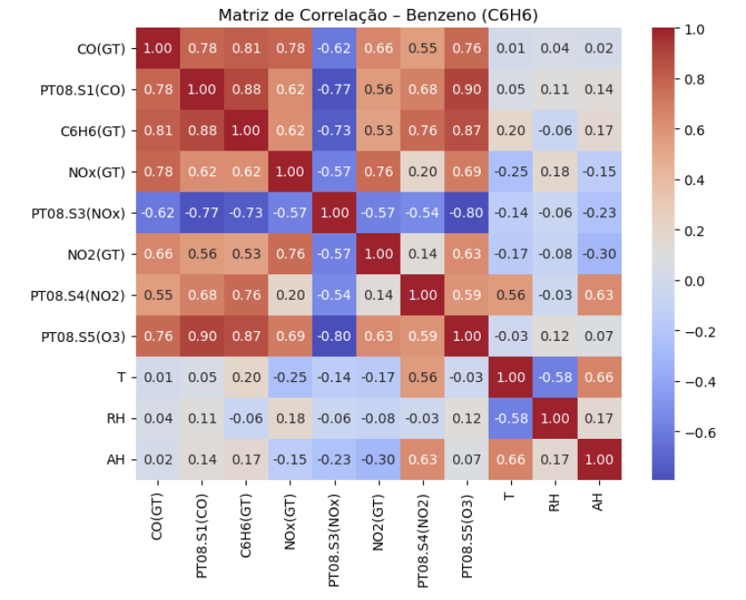
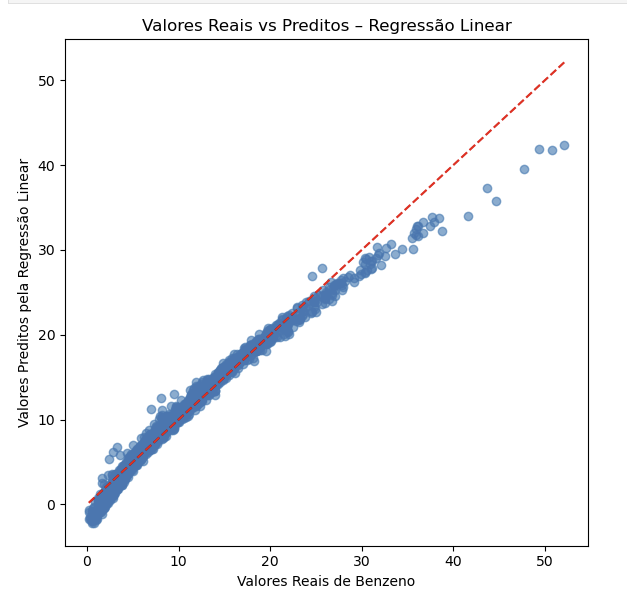
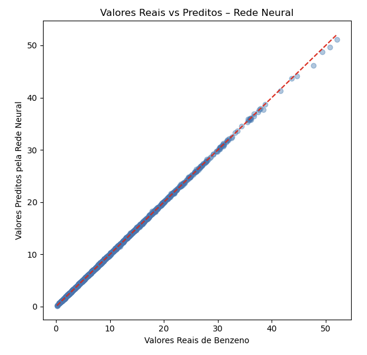

# Air Quality Prediction using Neural Networks

  

# Visão Geral do Projeto

Este projeto aplica técnicas de Ciência de Dados e Redes Neurais Artificiais para prever a concentração de Benzeno (C6H6) a partir de respostas de sensores químicos e variáveis meteorológicas. O estudo foi desenvolvido com foco em modelagem preditiva, comparação entre modelos lineares e não lineares e interpretação crítica dos resultados — seguindo boas práticas esperadas em um ambiente profissional.

O projeto utiliza o Air Quality Dataset (UCI Machine Learning Repository), amplamente conhecido na literatura, mas explorado aqui com uma abordagem estruturada, didática e orientada a negócio.

# Objetivo

Construir e avaliar modelos preditivos capazes de estimar a concentração real de Benzeno (C6H6(GT)) utilizando:

- Respostas de sensores de óxidos metálicos
- Variáveis meteorológicas
- Técnicas de Machine Learning e Redes Neurais

# Dataset

- **Fonte**: UCI Machine Learning Repository – Air Quality Dataset
- **Nome**: Air Quality Dataset
- **Link oficial**: https://archive.ics.uci.edu/ml/datasets/Air+Quality
- **Descrição**: Medições horárias de poluentes atmosféricos obtidas por sensores químicos e analisadores de referência certificados.
- **Variável alvo**: C6H6(GT) – concentração real de benzeno

⚠️ Observação: O dataset não está versionado neste repositório devido ao seu tamanho.

# Etapas do Projeto

## 1. Análise Exploratória dos Dados (EDA)

- Inspeção de variáveis
- Identificação de valores ausentes
- Análise estatística inicial

  

  <small><strong>Figura 1.</strong> Distribuição da variável alvo (Concentração de Benzeno)</small>

A análise da distribuição da concentração de benzeno permite compreender a variabilidade dos dados, identificar assimetrias e avaliar a adequação do problema à modelagem por regressão.

  

  <small><strong>Figura 2.</strong> Heatmap de correlação entre sensores e variáveis ambientais</small>

A matriz de correlação evidencia as relações entre sensores, variáveis meteorológicas e a concentração de benzeno, auxiliando na compreensão do comportamento do sistema e na justificativa das escolhas de modelagem.

## 2. Pré-processamento

- Tratamento de valores ausentes
- Remoção de colunas irrelevantes
- Padronização das variáveis
- Separação em conjuntos de treino e teste

## 3. Modelagem Preditiva

- Regressão Linear (baseline)

  

  <small><strong>Figura 3.</strong> Valores reais vs preditos – Modelo Regressão Linear</small>

A regressão linear foi utilizada como modelo baseline para avaliar o desempenho inicial e identificar limitações na captura de relações complexas entre os sensores e a concentração de benzeno.
  
- Rede Neural do tipo MLP (Multilayer Perceptron)

  

  <small><strong>Figura 4.</strong> Valores reais vs preditos – Modelo MLP</small>

A rede neural do tipo MLP apresentou desempenho significativamente superior, demonstrando alta capacidade de capturar relações não lineares entre as variáveis preditoras e a concentração real de benzeno.

## 4. Avaliação dos Modelos

- RMSE
- MAE
- R²
- Comparação de Desempenho dos Modelos

| Modelo             | RMSE     | MAE      | R²       |
|--------------------|----------|----------|----------|
| Regressão Linear   | 1.181182 | 0.836396 | 0.974607 |
| Rede Neural (MLP)  | 0.093018 | 0.057397 | 0.999843 |
  
A rede neural apresentou redução significativa dos erros (RMSE e MAE) e aumento do coeficiente de determinação (R²), evidenciando sua superioridade em relação ao modelo linear para a modelagem da concentração de benzeno.

# Modelos Utilizados

🔹 Regressão Linear (Baseline)
Modelo utilizado como referência para avaliar ganhos obtidos com modelos não lineares.

🔹 Rede Neural Artificial (MLP)

- Arquitetura feedforward
- Funções de ativação não lineares
- Capaz de capturar relações complexas entre sensores e concentração de poluentes

# Principais Resultados

A Rede Neural apresentou desempenho superior ao modelo linear, indicando que:
- A relação entre sensores e concentração de benzeno não é puramente linear
- Modelos baseados em ANN são mais adequados para esse tipo de problema ambiental

# Visualizações

## O projeto inclui gráficos como:

- Distribuição das variáveis
- Distribuição da variável alvo
- Heatmap de correlação
- Valores reais vs preditos – Regressão Linear/Redes Neurais
- Resíduos vs Previsões - Regressão Linear/Redes Neurais

# Estrutura do Repositório

Air-Quality/
│
├── README.md
├── requirements.txt
│
├── notebooks/
│   └── Air_Quality_final.ipynb
│
├── figure/
│   └── ├── distribuicao_alvo.png
│       ├── correlação_c6h6.png
│       ├── regressao_model.png
│       └── mlp_model.png
│
└── .gitignore

# Como executar o Projeto

git clone https://github.com/claudiarpaim/Air-Quality.git                                          
pip install -r requirements.txt                                             
jupyter notebook notebook/Air_Quality_final.ipynb  

# Autora

## Cláudia Rosa
Cientista de Dados Júnior | Química Ambiental

LinkedIn: (linkedin.com/in/claudia-rosa-datascience)

